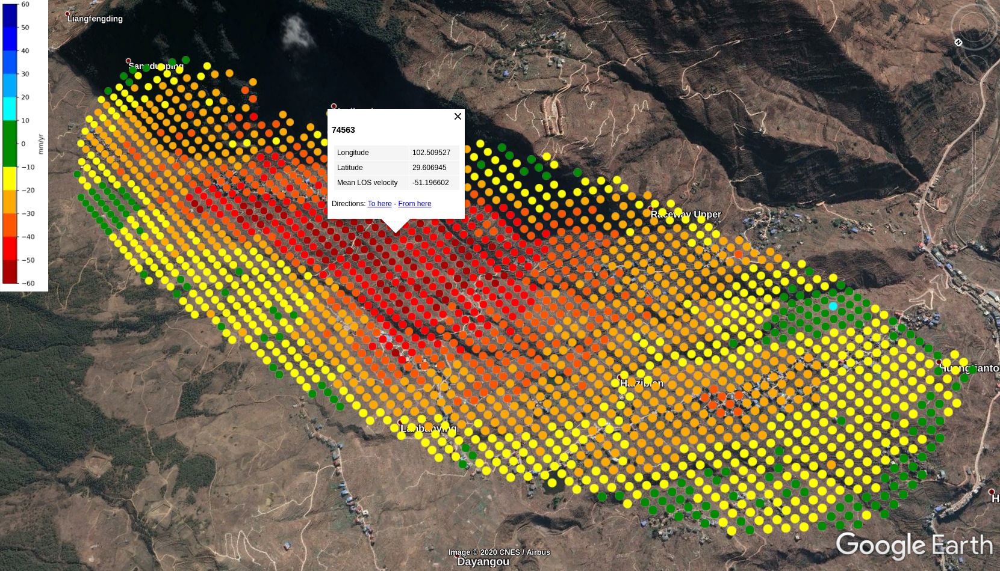
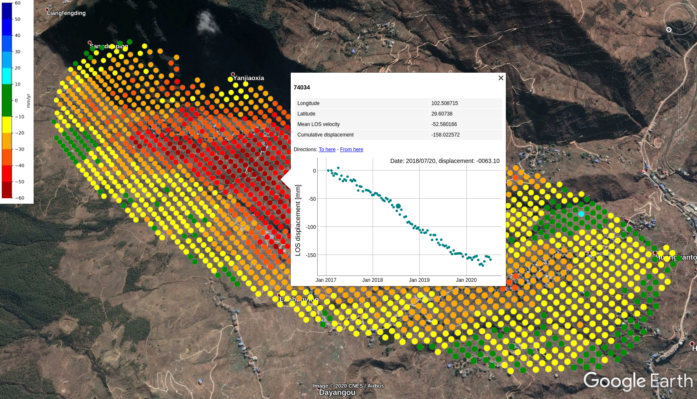

#### Data format required by make_kmz.py
```
num1 lon1 lat1 vel1
num2 lon2 lat2 vel2
num3 lon3 lat3 vel3
...
---------------------
1 100.1   30.1  20
2 100.1  30.15  10
5 100.2   31.1 -10
...
```

#### Made by make_kmz.py



#### Data format required by make_kmz_timeseries.py
```
  -1   -1   -1   -1       date1       date2       date3 ...
num1 lon1 lat1 vel1 date1-disp1 date2-disp1 date3-disp1 ...
num2 lon2 lat2 vel2 date1-disp2 date2-disp2 date3-disp2 ...
num3 lon3 lat3 vel3 date1-disp3 date2-disp3 date3-disp3 ...
num4 lon4 lat4 vel4 date1-disp4 date2-disp4 date3-disp4 ...
...
--------------------------------------------------------------------
-1     -1     -1   -1  20200101 20200113 20200201 20200213 20200301
 1  100.1   30.1   20         0        1        5        9       10
 2  100.1  30.15   10         0        5       -1       20       25
 5  100.2   31.1  -10         0      -10      -20      -23      -28
```

#### Made by make_kmz_timeseries.py

