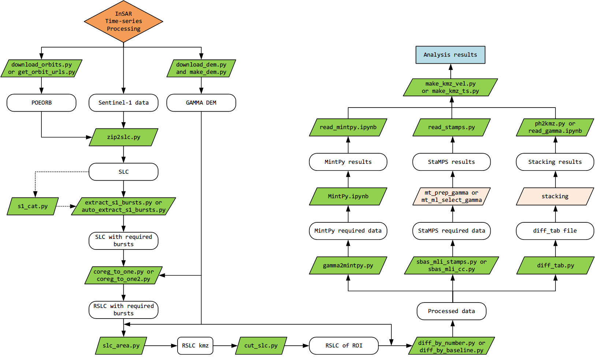

## CintPy ##

The Chenjiajun InSAR Tools in Python (CintPy) is an package for Interferometric Synthetic Aperture Radar (InSAR) time series processing. It mainly based on [GAMMA](https://www.gamma-rs.ch/no_cache/software.html), [MintPy](https://github.com/insarlab/MintPy), [StaMPS](https://github.com/dbekaert/StaMPS).

## How to use it ##

